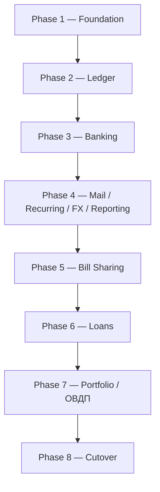

# Financial Core V2 — Implementation Roadmap

> **For agentic workers:** Execute the linked phase plans task by task. Keep checkbox state in the phase document, use test-first commits, and do not begin a dependent phase until its entry gate is satisfied.

**Goal:** Replace Moneykeeper's legacy mutable account/transaction model with the accepted context-first DDD financial core on a brand-new PostgreSQL database.

**Architecture:** A modular monolith organized by bounded context. Ledger is the strict double-entry core; other contexts coordinate typed financial effects through durable outbox/inbox process managers. The public API is task-oriented and intentionally breaking.

**Tech Stack:** Rust 2024, Axum 0.8, SQLx 0.8, PostgreSQL 16, Tokio, `rust_decimal`, Serde, UUID, Chrono, Reqwest, Testcontainers.

**Architecture Spec:** `docs/superpowers/specs/2026-08-05-finance-ddd-v2-design.md`

---

## Deliverable set

| Order | Plan | Primary result |
|---|---|---|
| 1 | `2026-08-05-finance-v2-phase-1-foundation.md` | Context skeleton, shared kernel, V2 DB/test path, reliable integration primitives |
| 2 | `2026-08-05-finance-v2-phase-2-ledger.md` | Immutable double-entry Ledger and replacement finance API |
| 3 | `2026-08-05-finance-v2-phase-3-banking.md` | Monobank connections/resources, durable import, balance reconciliation |
| 4 | `2026-08-05-finance-v2-phase-4-recurring-reporting.md` | Gmail/Mail port, Recurring port, external FX Reference Data, financial Reporting projections |
| 5 | `2026-08-05-finance-v2-phase-5-bill-sharing.md` | Contacts-first multiple-payer Split the Bill |
| 6 | `2026-08-05-finance-v2-phase-6-loans.md` | Borrowed/lent loan lifecycle and accounting workflows |
| 7 | `2026-08-05-finance-v2-phase-7-portfolio-ovdp.md` | Manual ОВДП instruments, lots, cash settlement, valuation |
| 8 | `2026-08-05-finance-v2-phase-8-cutover.md` | Fresh-database cutover, legacy removal, operational hardening |

This roadmap coordinates the plans; the phase documents contain the executable task detail and commit boundaries.

## Dependency graph



The numbered order is the integration and migration order. After Ledger's public contracts and integration events are stable, pure domain/application work for later contexts may be prototyped on short-lived branches, but a phase cannot pass its exit gate or land its migration until all lower-numbered migrations are integrated. Every such branch must rebase onto the complete preceding lineage and run a fresh database before merge. No persistent/shared V2 database may run a higher migration and later receive a lower one. Phase 8 starts only after every context passes its exit criteria on the same integrated revision.

## Global implementation rules

1. **Planning scope:** These documents authorize implementation only when a later task explicitly asks to execute a phase. Creating these documents does not change application code or databases.
2. **Legacy freeze:** Do not edit any file under `src/infrastructure/migrations`. Do not add a reset migration to that directory.
3. **Database isolation:** All V2 development tests use a fresh database and `src/infrastructure/migrations_v2`. Until Phase 8, production/default bootstrap remains on legacy wiring.
4. **Migration order:** Land and apply V2 migrations strictly in the frozen `0001`–`0011` order. Parallel feature work does not authorize an out-of-order migration commit or reuse of a database that has seen a higher version.
5. **No dual write:** A command is implemented in V2 and tested in isolation; it is not called from a legacy handler and does not update legacy tables.
6. **Test first:** Every task starts with a failing domain, contract, database, API, or workflow test. Record the expected failure before implementation.
7. **One aggregate transaction:** Aggregate changes, projections local to that context, audit, idempotency, and outbox commit in one SQL transaction.
8. **Context boundaries:** Cross-context code imports only `public.rs` and versioned event DTOs. It never imports repositories or executes SQL against a foreign schema.
9. **Immutable money:** Posted financial and Portfolio transaction rows cannot be updated or deleted. Changes create correction, reversal, or replacement records.
10. **Tenant safety:** Every aggregate and child relationship includes `user_id`; database constraints and command authorization both reject cross-user references.
11. **Exact values:** HTTP money is a decimal string plus currency. Tests must never compare financial values through floating-point conversion.
12. **Idempotency:** All financial commands, including internal process-manager commands, carry a scoped key and canonical request hash.
13. **Observable eventual consistency:** Cross-context workflows expose `pending`, `posted`, or `failed`, plus correlation ID and last error where appropriate.

## Phase gates

### Phase 1 — Foundation

**Entry:** Architecture spec accepted. Legacy migration checksums are known and the deployment is confirmed development-only.

**Exit:**

- Context skeleton compiles without changing existing routes or worker startup.
- Money/currency/ID/event primitives pass unit and serialization tests.
- Currency catalog, category lifecycle, and base-currency preference operations are exact in the isolated V2 router/OpenAPI while the default legacy router remains unchanged.
- A parallel V2 test helper migrates a brand-new PostgreSQL database without using the legacy path.
- Transactional outbox/inbox and process-manager lease primitives pass rollback, duplicate, and lease-fencing tests.
- Architecture checks reject imports of another context's repository/infrastructure module and foreign-schema SQL.
- The V2 database-generation marker is created and verified by the parallel bootstrap.

### Phase 2 — Ledger

**Entry:** Phase 1 exit gate passes.

**Exit:**

- Database constraints reject unbalanced, cross-user, wrong-currency, zero, mutable, and deletable posted rows.
- Account lifecycle, opening balances, income, expense, same-currency/FX transfer, fees, correction, reversal, replacement, annotation, and reconciliation approval are implemented behind task commands.
- One Ledger unit of work commits journal, postings, balance projections, audit, idempotency result, and outbox together.
- Concurrent duplicate commands have exactly one financial effect.
- Projection rebuild equals posting sums after success, rollback, retry, and concurrent posting tests.
- The replacement finance router and OpenAPI fragment pass contract tests but are not yet mounted in default bootstrap.
- Ledger's public command/query/event contracts are versioned and frozen for downstream phases.

### Phase 3 — Banking

**Entry:** Ledger provider-import and balance-observation contracts are frozen.

**Exit:**

- One encrypted X-Token connection discovers separate card/current-account and jar resources.
- Resource mapping validates currency and account ownership without Banking writing Ledger tables.
- Durable sync jobs survive restart, enforce per-token limiting, retry pages, and advance a cursor only after complete page processing.
- Provider event identity/revisions cover duplicate delivery, hold-to-settled, monetary correction, and reversal.
- Webhook path secrets and validation requests are tested; raw financial bodies are absent from logs.
- Provider observations produce approval-based reconciliation cases and never overwrite Ledger balance.
- Users can inspect resource, event, sync-job, and accounting-process status.

### Phase 4 — Mail, Recurring, and Reporting

**Entry:** Phase 3 exit gate passes; Ledger event/annotation contracts and Banking observation events are stable. Mail/Recurring/FX tasks may have been developed earlier, but Phase 4 integrates only on the complete `0001`–`0004` lineage.

**Exit:**

- Gmail credentials are encrypted-only; messages are immutable; attempts and leases are durable and append-only.
- Current receipt parsing, retry, lifecycle, and subscription inventory behavior is preserved on V2.
- Recurring matching uses a local Ledger candidate projection and allocated journal-entry match events; no legacy `transaction_id` relationship remains.
- Categorization goes through Ledger's public annotation command.
- Immutable external FX observations and durable NBU synchronization are owned by Reference Data; Reporting consumes their events and exposes explicit missing historical conversions.
- Reporting projections cover required balance/cashflow/spending/liability/reconciliation/recurring/net-worth views and rebuild exactly from public event feeds.
- No Mail, Recurring, or Reporting SQL names a Ledger private table.

### Phase 5 — Bill Sharing

**Entry:** Phase 4 exit gate passes, and Ledger reclassification, contact control-account, imported-entry query, and reversal contracts are stable.

**Exit:**

- Contacts-first bills support multiple payers, exact/equal shares, deterministic minor-unit rounding, and current-user/external contributions.
- Contribution and share totals equal the bill total; derived obligations conserve every participant's net position.
- Current-user contributions can be manual or allocated across existing outgoing Ledger journals.
- Accounting process states are durable and create correct receivable/payable reclassifications.
- Manual and imported-entry settlements support partial amounts and reject overpayment.
- Settlements must be reversed before bill revision/cancellation; all accounting reversals remain visible.

### Phase 6 — Loans

**Entry:** Phase 5 exit gate passes, and Ledger liability/receivable accounts, typed loan-accounting command, and process-manager runtime are stable.

**Exit:**

- Borrowed and lent agreements support disbursement, repayment, manual interest accrual, fees, write-off, reversal, and closure.
- Principal, interest, and fee components remain separate in domain, Ledger, API, and Reporting events.
- Each workflow exposes pending/posted/failed status and is retry-safe.
- Contract terms and lifecycle remain owned by Loans; no amortization scheduler is introduced.

### Phase 7 — Portfolio and ОВДП

**Entry:** Phase 6 exit gate passes; shared decimal/currency primitives, Ledger Portfolio-settlement command, event runtime, and Reporting ingestion contract are stable.

**Exit:**

- Manual ОВДП instruments and portfolio accounts support opening, buy, sell, coupon, redemption, correction, and reversal.
- Lot creation and explicit/FIFO disposal are exact, deterministic, and concurrency safe.
- Position quantity, remaining cost, realized gain/loss, and append-only valuation snapshots rebuild from immutable Portfolio facts.
- Optional cash effects post once through Ledger with a shared correlation ID and visible process status.
- Reporting combines Ledger and Portfolio exactly once; valuation never mutates cash balance.

### Phase 8 — Cutover

**Entry:** All prior phase exit criteria pass together against fresh V2 databases. Reconnection and reset are accepted operationally.

**Exit:**

- Legacy workers are stopped before `DATABASE_URL` changes.
- A brand-new database is provisioned, V2 baseline migrated, and generation marker verified.
- Every SQLx runtime/test migrator points to `migrations_v2`; legacy checksum files remain untouched.
- Replacement unversioned routes are mounted and legacy finance handlers/services/repositories are removed from executable code.
- CI rejects executable SQL against legacy finance tables and validates OpenAPI.
- Monobank/Gmail reconnection and development reset runbooks are accurate and rehearsed.
- Full format, clippy, test, migration, projection-rebuild, security, and smoke-test gates pass before workers start.

## Requirement traceability

| Requirement | Owning phase | Proof |
|---|---|---|
| Calculated account balance | 2 | Posting-sum/projection equivalence tests |
| Visible balance correction | 2 | Correction journal + audit/API contract tests |
| Cash/cards/current/jars | 2, 3 | Ledger kinds + Monobank resource mapping tests |
| Provider balance not authoritative | 2, 3 | Observation/reconciliation approval tests |
| Money-change history | 2 | Immutability/reversal/activity tests |
| Gmail/subscription parity | 4 | Ingestion/matching/lifecycle end-to-end tests |
| Historical FX/base-currency reports | 4 | Immutable NBU observations, replay, and explicit missing-rate tests |
| Split the Bill | 5 | Multi-payer/allocation/settlement property and workflow tests |
| Borrowed/lent loans | 6 | Principal/interest/fee lifecycle tests |
| Manual ОВДП | 7 | Lot/coupon/maturity/valuation/cash-correlation tests |
| Clean breaking reset | 1, 8 | V2 marker, migrator scan, fresh baseline and runbook rehearsal |

## Cross-phase contract freeze

At the end of Phase 2, publish and review:

- `LedgerCommands` and `LedgerQueries` façades;
- task command/request and result types;
- system/control account roles used by downstream contexts;
- journal/reversal/annotation event v1 schemas;
- idempotency/error semantics;
- correlation and process-completion contracts.

After freeze, compatible fields may be added, but removing/changing existing fields requires a new event or command version and updates to every consumer contract test. The same rule applies to Banking events after Phase 3 and Portfolio/Sharing/Loans events before Reporting cutover.

## Commit and integration strategy

- Use the commit boundaries in each phase document. A boundary should compile and leave all previously green tests green.
- Do not combine a schema invariant, domain behavior, HTTP contract, and legacy cleanup in one unreviewable commit.
- Rebase/merge downstream phase branches only after the upstream public-contract commit is final.
- Keep legacy-removal commits in Phase 8 separate from V2 activation so a review can distinguish wiring from deletion.
- Never commit real Monobank/Gmail credentials or unredacted financial fixtures.

## Continuous verification

Run targeted tests after each task and the following at every phase exit:

```bash
cargo fmt --check
cargo clippy --all-targets -- -D warnings
cargo test
SQLX_OFFLINE=true cargo test --test v2_migrations -- --nocapture
```

Once OpenAPI fragments exist:

```bash
cargo test --test openapi_v2 -- --nocapture
```

Once architecture guards exist:

```bash
cargo test --test context_boundaries -- --nocapture
```

Phase 8 promotes `v2_migrations` to the default migration test/helper names only where its plan explicitly instructs; it does not rename or alter legacy SQL files.

## Risk register

| Risk | Control | Gate |
|---|---|---|
| V2 binary points at legacy DB | Generation marker + separate provisioning + startup refusal | 1, 8 |
| Projection differs from source | Atomic write + rebuild and property tests | 2 |
| Duplicate provider/HTTP effects | Scoped request hashes + unique constraints + retries | 2, 3 |
| Cross-context coupling returns | Rust visibility + architecture/SQL scans | Every phase |
| Event delivery gap | Transactional outbox, inbox dedup, leases, lag metrics | 1 onward |
| Provider correction hidden | Revision history + reversal/replacement | 3 |
| Split creates false income/expense | Typed reclassification and receivable/payable tests | 5 |
| Loan totals become ambiguous | Explicit principal/interest/fee components | 6 |
| Portfolio double-counts net worth | Hidden settlement control + Reporting contract tests | 7 |
| Cutover starts duplicate workers | Stop/start checklist and worker-start barrier | 8 |

## Final definition of done

The V2 work is complete only when a fresh deployment can:

1. Create manual cash/card/liability accounts and explain every balance from activity.
2. Correct a balance with a visible, reversible event.
3. Connect Monobank, map cards/jars, import revisions safely, and request approval for discrepancies.
4. Reconnect Gmail, ingest receipts, match allocations, categorize through Ledger, and report recurring totals.
5. Record and settle a multiple-payer bill without classifying repayment as income.
6. Record borrowed/lent loan principal, interest, and fees correctly.
7. Track a manual ОВДП position, FIFO sale, coupon, maturity, valuation, and correlated cash settlement.
8. Rebuild every financial/read projection exactly after deleting only projection data.
9. Reject all tested tenant, balance, mutation, idempotency, and worker-retry violations.
10. Run exclusively on the new V2 database while preserving the legacy migration lineage unchanged.
