# Financial Core V2 — Phase 8: Breaking Cutover and Hardening

> **For agentic workers:** REQUIRED SUB-SKILL: Use `superpowers:subagent-driven-development` (recommended) or `superpowers:executing-plans` when available. This phase contains the irreversible runtime switch. Complete every preflight check before changing `DATABASE_URL`, and never delete the legacy database or migration files.

**Goal:** Promote the fully tested V2 modular monolith to the existing unversioned API on a brand-new PostgreSQL database, remove legacy runtime paths, harden startup/CI/operations, and preserve the old database and migration lineage for recovery and forensic history.

**Dependencies:** Phases 1–7 are integrated and all exit gates pass on fresh V2 databases. The deployment is still development-only, data discard is approved, and users will reconnect Monobank and Gmail. There is no compatibility or dual-write requirement.

**Irreversible precondition:** The target `DATABASE_URL` must name a newly provisioned, blank Finance V2 database. The old Docker named volume must not be mounted by that database. No legacy finance data is expected to appear in V2, and all provider connections must be re-established after cutover.

**Architecture:** Cut over at the application and database boundary, not through a destructive SQL migration. Stop the legacy process and all embedded workers, provision a separate database, apply only `migrations_v2`, verify the V2 generation marker/invariants, deploy the V2 bootstrap and unversioned router, then start V2 dispatchers/workers. Legacy modules and executable SQL are removed; the checksum-frozen migration directory remains read-only.

**Tech Stack:** Rust 2024, Axum, SQLx/PostgreSQL 16, Tokio, Docker Compose/Fly development configuration, Testcontainers, static OpenAPI 3.1 validation.

**Spec:** `docs/superpowers/specs/2026-08-05-finance-ddd-v2-design.md`

---

## Evidence-first task protocol

Tasks that change code or configuration follow explicit **RED → GREEN → REFACTOR** discipline: first add a failing contract/safety check, make the smallest change, then run boundary and regression gates before commit. Operational Tasks 1, 8, 9, and 10 introduce no product behavior; they are evidence-first preflight, rehearsal, execution, and verification steps. A source/config correction discovered there returns to its owning test-first task and requires a new frozen candidate.

## Safety rules

1. Never point a V2 binary at the legacy database.
2. Never point a legacy binary at the V2 database.
3. Do not edit, renumber, delete, or append reset SQL to `src/infrastructure/migrations`.
4. Do not run `DROP SCHEMA public CASCADE`, `DROP DATABASE`, `TRUNCATE ... CASCADE`, or delete the old Docker volume as part of this plan.
5. Stop the whole legacy application before switching `DATABASE_URL`; its Monobank, Gmail, subscription, lifecycle, and FX schedulers run inside `main.rs`.
6. Start V2 workers only after migrations, database-generation check, cryptographic configuration, and invariant smoke tests pass.
7. Rollback means stopping V2 and restoring the old binary plus old `DATABASE_URL`. It does not mean copying V2 rows backward.

## Cutover state sequence

```mermaid
stateDiagram-v2
    [*] --> LegacyRunning
    LegacyRunning --> LegacyStopped: stop HTTP process and all workers
    LegacyStopped --> V2Provisioned: create separate DB/volume
    V2Provisioned --> V2Migrated: apply migrations_v2 only
    V2Migrated --> V2Verified: marker + invariants + smoke tests
    V2Verified --> V2Serving: start HTTP with workers gated
    V2Serving --> V2Operational: reconnect providers and confirm event lag
    V2Verified --> LegacyStopped: verification fails; repair V2
    V2Serving --> LegacyRunning: rollback binary + DATABASE_URL
```



There is intentionally no transition that mutates the legacy database into V2.

## File map

| File | Action |
|---|---|
| `src/main.rs` | Replace — minimal V2 bootstrap/listener and controlled worker startup |
| `src/lib.rs` | Modify — export context-first modules; remove legacy horizontal module exports |
| `src/bootstrap/v2.rs` | Modify/rename as appropriate — become default application bootstrap |
| `src/bootstrap/workers.rs` | Modify — register only V2 leased workers/dispatchers |
| `src/bootstrap/mod.rs` | Modify — default V2 construction and readiness barrier |
| `src/api/routes.rs` | Replace — compose context routers at existing unversioned paths |
| `src/api/state.rs` | Replace — context façades/read composition only |
| `src/api/v2_state.rs` | Delete/rename after its tested composition becomes the default `state.rs` |
| `src/api/dto.rs` | Delete — legacy cross-domain DTO collection |
| `src/api/handlers/accounts.rs` | Delete — legacy account handler |
| `src/api/handlers/categories.rs` | Delete — Phase 1 Classification API is the tested replacement |
| `src/api/handlers/email_connections.rs` | Delete — legacy Mail handler |
| `src/api/handlers/monobank.rs` | Delete — legacy provider write path |
| `src/api/handlers/subscriptions.rs` | Delete — legacy Recurring handler |
| `src/api/handlers/transactions.rs` | Delete — legacy transaction handler |
| `src/api/handlers/user_settings.rs` | Delete — Phase 1 Preferences API is the tested replacement |
| `src/api/handlers/mod.rs` | Delete/replace — no legacy exports |
| `src/application/` | Delete after all required behavior is present under contexts |
| `src/domain/` | Delete after all required behavior is present under contexts/shared kernel |
| `src/infrastructure/account_repository.rs` | Delete |
| `src/infrastructure/category_repository.rs` | Delete |
| `src/infrastructure/email_connection_repository.rs` | Delete |
| `src/infrastructure/email_sync_repository.rs` | Delete |
| `src/infrastructure/fx_rate_repository.rs` | Delete after Reference Data port |
| `src/infrastructure/monobank_client.rs` | Delete after Banking adapter port |
| `src/infrastructure/monobank_repository.rs` | Delete |
| `src/infrastructure/nbu_client.rs` | Delete after Reference Data adapter port |
| `src/infrastructure/stats_repository.rs` | Delete |
| `src/infrastructure/subscription_charge_repository.rs` | Delete |
| `src/infrastructure/subscription_repository.rs` | Delete |
| `src/infrastructure/transaction_repository.rs` | Delete |
| `src/infrastructure/user_settings_repository.rs` | Delete |
| `src/infrastructure/email/` | Delete after Mail adapter/parser port |
| `src/infrastructure/credential_crypto.rs` | Delete or move final shared secret adapter; no mixed-context rotation remains |
| `src/infrastructure/db.rs` | Modify — use V2 migrator and mandatory generation check |
| `src/infrastructure/test_db.rs` | Modify — make fresh V2 helper the default |
| `src/infrastructure/mod.rs` | Modify — export only V2/shared infrastructure |
| `src/bin/rotate_credentials.rs` | Delete/replace with context-specific key-rotation command if V2 already provides one |
| `src/infrastructure/migrations/` | Preserve unchanged — forensic/checksum history, never executed by V2 |
| `src/infrastructure/migrations_v2/` | Preserve/promote — only runtime migration root |
| `tests/common/mod.rs` | Modify — default to fresh V2 DB helper |
| `tests/migrations.rs` | Delete — legacy upgrade/deployment fixture tests |
| `tests/v2_migrations.rs` | Modify/rename to `tests/migrations.rs` — fresh-baseline invariant suite |
| `tests/legacy_migration_checksums.rs` | Create — file-only checksum guard; does not execute legacy SQL |
| `tests/context_boundaries.rs` | Modify — reject legacy SQL/table references and forbidden imports |
| `tests/api.rs` and `tests/api/` | Delete/replace — legacy contracts removed, V2 contract tests become default |
| `tests/subscriptions_end_to_end.rs` | Delete after equivalent V2 Recurring workflow coverage exists |
| `static/openapi.json` | Replace — promote validated V2 OpenAPI document |
| `static/openapi.v2.json` | Delete after byte-for-byte promotion |
| `static/swagger-ui.html` | Modify only if route/spec URL changed |
| `docker-compose.yml` | Modify — explicit new V2 database/volume identity |
| `Dockerfile` | Modify if startup/migration command changes |
| `fly.toml` | Modify development service/database configuration if still used |
| `.env.example` | Create/modify — V2 DB marker, secrets, worker/runtime settings without credentials |
| `docs/operations/finance-v2-development-cutover.md` | Create — exact preflight/switch/verify/rollback runbook |
| `docs/operations/integration-reconnection.md` | Create — Monobank/Gmail reconnect procedure |
| `docs/architecture/finance-v2-context-map.md` | Create — short maintainer boundary/ownership guide |
| `scripts/check_no_legacy_finance_sql.sh` | Create — CI guard with explicit allowlist |
| CI workflow file used by repository | Modify/create — run format, clippy, tests, migrations, OpenAPI, architecture/legacy scans |

Delete actions occur only after read-only searches prove the V2 equivalent exists and is covered. If an earlier phase already moved a listed shared utility, adjust the delete target without duplicating it.

---

## Task 1: Capture the initial integrated baseline and preflight evidence

**Files:**

- Create: `docs/operations/finance-v2-development-cutover.md`
- Modify: this plan to record the baseline commit and gate results

- [ ] **Step 1: Record the candidate identity and assumptions**

Record the initial baseline SHA, Rust toolchain, PostgreSQL version, current legacy database identifier (redacted hostname), intended new V2 database identifier, migration count/checksum output for both lineages, and responsible operator. Explicitly state that legacy rows and credentials will not be migrated. This is not yet the deployable frozen SHA; Tasks 2–8 are expected to change it.

- [ ] **Step 2: Run all pre-cutover gates on a fresh V2 database**

```bash
cargo fmt --check
cargo clippy --all-targets -- -D warnings
cargo test
SQLX_OFFLINE=true cargo test --test v2_migrations -- --nocapture
cargo test --test context_boundaries -- --nocapture
cargo test --test openapi_v2 -- --nocapture
```

Run full projection rebuild and representative end-to-end scenarios from Phases 2–7. Save command names and pass/fail summaries in the runbook; do not save credentials or raw financial payloads.

- [ ] **Step 3: Inventory every runtime worker and SQLx migrator**

```bash
rg -n "tokio::spawn|interval\(|restart_incomplete|claim_|lease" src
rg -n "sqlx::migrate!|migrations =" src tests
```

Expected before switch: all intended V2 workers are known, and exactly the four legacy migrator call sites are scheduled for replacement (`src/infrastructure/db.rs`, `src/infrastructure/test_db.rs`, `tests/common/mod.rs`, and migration tests), plus any V2-parallel helpers created since Phase 1.

- [ ] **Step 4: Verify legacy migration files are unchanged**

Compare all 25 files against the recorded checksum manifest. Do not repair a mismatch by changing the manifest; investigate and restore the original bytes through an approved non-destructive source.

- [ ] **Step 5: Commit the reviewed runbook**

```bash
git add docs/operations/finance-v2-development-cutover.md docs/superpowers/plans/2026-08-05-finance-v2-phase-8-cutover.md
git commit -m "docs(cutover): add finance v2 development runbook"
```

---

## Task 2: Make V2 database identity impossible to ignore

**Files:**

- Modify: `src/infrastructure/v2_db.rs` (or the final Phase 1 module name)
- Modify: `tests/v2_migrations.rs`
- Create/modify: startup database-generation tests in the Phase 1 test location

- [ ] **Step 1: Write failing generation-guard tests**

Test startup against:

- an empty unmigrated database;
- a fully migrated V2 database whose `shared_kernel.database_lineage` marker is `finance-v2`;
- a legacy database with `_sqlx_migrations` but no V2 marker;
- a database with the wrong marker;
- a partially migrated V2 database.

The empty database must migrate to the complete baseline before construction; the complete V2 database reopens idempotently; and a correctly marked partial V2 lineage may resume migrations but cannot reach construction unless it reaches the exact latest baseline. Legacy/unmarked non-empty/wrong-marker databases are rejected before any V2 SQL mutates them. An injected migration failure leaves listeners and workers stopped. Error messages must identify the safety problem without logging the database URL password.

- [ ] **Step 2: Finalize the verified V2 initializer without switching the legacy runtime**

Harden Phase 1's `initialize_v2`/`VerifiedV2Pool` so its embedded migrator and latest-baseline check cannot drift. Keep the default `src/infrastructure/db.rs`, `main.rs`, `v2_test_db`, `src/infrastructure/test_db.rs`, `tests/common/mod.rs`, and old migration/API runtime unchanged in this commit. Task 4 atomically switches the application call site together with bootstrap/router promotion; Task 6 later promotes the test helper after legacy tests are removed. Do not configure `ignore_missing` to tolerate legacy history.

- [ ] **Step 3: Enforce startup order**

Encode the pre-bootstrap portion as connect, run V2 migrations, verify generation/latest baseline, and return `VerifiedV2Pool`. The parallel V2 bootstrap tests then run readiness invariants with provider calls disabled. No external provider call happens before the marker check. The default legacy application is still coherent/runnable at this commit.

- [ ] **Step 4: Run focused tests**

```bash
SQLX_OFFLINE=true cargo test --test v2_migrations -- --nocapture
cargo test database_generation -- --nocapture
```

- [ ] **Step 5: Commit**

```bash
git add src/infrastructure/v2_db.rs tests/v2_migrations.rs
git commit -m "build(cutover): harden verified v2 initialization"
```

Use the actual Phase 1 module path if it differs from `v2_db.rs`; do not create a duplicate initializer.

---

## Task 3: Replace bootstrap and worker wiring

**Files:**

- Modify: `src/bootstrap/mod.rs`
- Modify: `src/bootstrap/v2.rs`
- Modify: `src/bootstrap/workers.rs`
- Add/modify bootstrap integration tests

- [ ] **Step 1: Write failing bootstrap tests**

Assert:

- each context façade/UoW receives only the successfully initialized `VerifiedV2Pool`, with no unchecked `PgPool` construction path;
- context process managers receive only public façades;
- workers do not start when migrations/marker/secret config fails;
- one worker registry starts Banking sync, Mail sync, Recurring lifecycle, outbox dispatch, process-manager retries, Reporting consumers, and Reference Data work exactly once per configured replica/lease policy;
- the listener may bind only with readiness false; business traffic remains unavailable until the worker registry/barrier succeeds, after which readiness flips true exactly once;
- shutting down cancels claims gracefully and stops accepting HTTP before worker teardown;
- no legacy service/repository constructor is reachable.

- [ ] **Step 2: Prepare a small V2 run entry point behind the parallel bootstrap**

Build a tested `bootstrap::v2::run`/composition function that loads validated configuration, initializes redacted logging, accepts only `VerifiedV2Pool`, builds the app, binds a supplied listener with readiness false, initializes and starts the leased worker registry, flips readiness true only after the barrier succeeds, and handles graceful shutdown. Keep `main.rs`, the default API state/routes, and legacy module exports unchanged in this commit. If worker initialization fails, readiness stays false and the test listener shuts down; business routes never serve during a partial start.

- [ ] **Step 3: Add a readiness barrier**

Readiness reports false until migrations, marker, cryptographic keys, context construction, listener binding, and dispatcher/worker initialization succeed. The single startup order is: verify database/configuration → construct contexts → bind with readiness false → start/verify workers → readiness true. Shutdown performs the inverse visibility boundary: readiness false → stop accepting business traffic → drain/cancel workers. Expose lag/failed-process health without treating a transient provider outage as database corruption.

- [ ] **Step 4: Run tests**

```bash
cargo test bootstrap_ -- --nocapture
cargo test worker_registry_ -- --nocapture
cargo test readiness_ -- --nocapture
```

- [ ] **Step 5: Commit**

```bash
git add src/bootstrap tests
git commit -m "refactor(cutover): prepare v2 bootstrap and worker barrier"
```

---

## Task 4: Promote the replacement unversioned API

**Files:**

- Replace: `src/main.rs`
- Modify: `src/lib.rs`
- Modify: `src/infrastructure/db.rs`
- Replace: `src/api/routes.rs`
- Modify: `src/api/state.rs`
- Delete/rename: `src/api/v2_state.rs` after promoting its tested contents/imports
- Replace: `static/openapi.json`
- Delete: `static/openapi.v2.json`
- Modify: `static/swagger-ui.html` if needed
- Replace legacy API test root with V2 contract/smoke suite

- [ ] **Step 1: Write failing route-manifest tests**

Generate an exhaustive operation manifest from every method/path/operation ID in validated `static/openapi.v2.json` and assert the default router has exact parity with the already-tested isolated `src/api/v2.rs` router. This includes Ledger, Banking, Mail, Recurring, Reporting, Sharing, Loans, and Portfolio commands and reads—not only the architecture spec's primary route excerpt. Assert all public operations are mounted at unversioned paths, authenticated where required, and absent beneath `/v2`. Keep a separate explicit manifest entry/test for the deliberately non-public Monobank callback route because it is omitted from public OpenAPI. Assert legacy mutation semantics—including account hard delete, direct balance setter, standalone transaction delete, and a Monobank webhook without its path secret—return `404` rather than silently mapping to V2 behavior.

- [ ] **Step 2: Compose context routers**

In one green change, point `src/infrastructure/db.rs` at the verified V2 initializer, replace `main.rs` with the tested Phase 8 V2 run entry point, switch module exports/API state, and promote or delegate to the exact router composition already exported by `src/api/v2.rs`; do not manually reconstruct a second list that can drift. The API layer may compose Ledger and Banking/Reporting read DTOs for account balance details, but it cannot query private tables. Keep authentication/error/request-ID middleware centralized and keep context request mapping inside each context API module. There is no commit where the default V2 migrator runs legacy services or where the new bootstrap serves legacy routes.

- [ ] **Step 3: Promote the validated OpenAPI document**

Replace `static/openapi.json` with the already validated V2 specification and delete the parallel file. Verify every financial POST declares `Idempotency-Key`, every aggregate metadata mutation declares body `expected_version`, amounts are decimal strings with currency, and posted resources expose reversal/correction/source/as-of fields.

- [ ] **Step 4: Run API tests**

```bash
cargo test --test api -- --nocapture
cargo test --test openapi -- --nocapture
cargo test bootstrap_ -- --nocapture
SQLX_OFFLINE=true cargo test --test v2_migrations -- --nocapture
```

- [ ] **Step 5: Commit**

```bash
git add src/main.rs src/lib.rs src/infrastructure/db.rs src/api static tests/api.rs tests/api
git commit -m "feat(cutover): atomically promote v2 runtime and unversioned api"
```

---

## Task 5: Remove legacy runtime code without removing history

**Files:**

- Delete legacy files/directories listed in the file map after equivalence checks
- Modify: `src/lib.rs`
- Modify: `src/infrastructure/mod.rs`
- Modify: `Cargo.toml` and `Cargo.lock` only for dependencies no longer used
- Preserve: `src/infrastructure/migrations/**`
- Preserve/move only redacted receipt fixtures still used by V2 Mail tests

- [ ] **Step 1: Produce an equivalence checklist before each deletion group**

Map legacy behavior to a passing V2 test for accounts/transactions, Monobank, Gmail, subscriptions, preferences/reference data, and reporting. If a current capability lacks an agreed V2 equivalent, stop and implement it in its owning phase rather than keeping a legacy repository wired to V2.

- [ ] **Step 2: Delete horizontal legacy domain/application modules**

Remove `src/domain/` and `src/application/` only after `rg` shows all needed types/use cases exist under `shared_kernel` or `contexts`. Update `lib.rs` so the old module paths cannot compile.

- [ ] **Step 3: Delete legacy handlers and repositories**

Remove the table-coupled files listed in the file map. Retain/move generic authentication, error, HTTP middleware, token encryption, and provider parsing only where their V2 owner is explicit. Remove the combined credential-rotation binary unless it has already become context-safe.

- [ ] **Step 4: Remove unused dependencies and build**

```bash
cargo check --all-targets
cargo clippy --all-targets -- -D warnings
```

- [ ] **Step 5: Prove legacy migrations remain unchanged**

Run the file-only checksum test. The old SQL exists only under the preserved migration directory and documentation/fixtures allowlists.

- [ ] **Step 6: Commit deletion separately**

```bash
git add -A src Cargo.toml Cargo.lock tests
git commit -m "refactor(cutover): remove legacy finance runtime"
```

---

## Task 6: Replace migration-upgrade tests and add CI boundary guards

**Files:**

- Delete: `tests/migrations.rs` legacy contents (or replace after renaming the V2 suite)
- Rename/modify: `tests/v2_migrations.rs` to the default migration suite
- Modify: `src/infrastructure/test_db.rs` — promote the fresh V2 helper after legacy tests are gone
- Modify: `tests/common/mod.rs` — use the promoted V2 helper for replacement tests
- Create: `tests/legacy_migration_checksums.rs`
- Modify: `tests/context_boundaries.rs`
- Create: `scripts/check_no_legacy_finance_sql.sh`
- Modify/create: repository CI workflow

- [ ] **Step 1: Preserve legacy checksums without executing legacy SQL**

The checksum test reads all 25 files, verifies the frozen version/name/checksum manifest, and fails on addition, removal, or byte change. It must not run those migrations against a V2 database.

- [ ] **Step 2: Promote the V2 test helper and make fresh-baseline invariants the migration suite**

Only after Tasks 4–5 have replaced/deleted legacy API/runtime tests, switch `src/infrastructure/test_db.rs` and `tests/common/mod.rs` to the single V2 migrator/helper; remove or rename the temporary parallel helper without duplicating container logic. On PostgreSQL 16, migrate an empty database through the complete V2 lineage and test:

- schema generation/latest version;
- composite tenant constraints;
- Ledger balancing and immutability;
- idempotency/reversal uniqueness;
- provider/source revision uniqueness;
- append-only Mail/Recurring evidence;
- Sharing totals/settlement constraints;
- Loans/Portfolio immutability;
- full projection rebuild entry points.

Delete the old deployed-0011/upgrade/backfill/concurrent-index scenarios; they describe the legacy lineage only.

- [ ] **Step 3: Add executable-SQL and import guards**

The script/test scans Rust source and active V2 SQL for legacy table names such as `accounts`, `transactions`, `transfer_links`, `bank_connections`, `subscription_charges`, and legacy unqualified queries. Use token-aware patterns and an explicit allowlist for the frozen legacy migration directory, checksum test, and documentation. It also rejects `contexts::<x>::infrastructure`/repository imports from another context.

- [ ] **Step 4: Wire CI gates**

CI runs format, clippy with warnings denied, full tests, fresh V2 migration tests, architecture/legacy SQL scans, OpenAPI validation, and secret/logging tests.

- [ ] **Step 5: Run locally**

```bash
./scripts/check_no_legacy_finance_sql.sh
cargo test --test legacy_migration_checksums -- --nocapture
SQLX_OFFLINE=true cargo test --test migrations -- --nocapture
cargo test --test context_boundaries -- --nocapture
```

- [ ] **Step 6: Commit**

```bash
git add src/infrastructure/test_db.rs tests/common/mod.rs tests scripts .github
git commit -m "test(cutover): enforce v2 migrations and context boundaries"
```

If the repository uses a CI directory other than `.github`, stage that actual path instead.

---

## Task 7: Prepare development infrastructure and reconnection docs

**Files:**

- Modify: `docker-compose.yml`
- Modify: `Dockerfile` if needed
- Modify: `fly.toml` if used for this development deployment
- Create/modify: `.env.example`
- Modify: `docs/operations/finance-v2-development-cutover.md`
- Create: `docs/operations/integration-reconnection.md`
- Create: `docs/architecture/finance-v2-context-map.md`

- [ ] **Step 1: Give the V2 database and volume distinct identities**

Use explicit names such as `moneykeeper_v2` and a new V2 volume. Do not reuse the current named volume. Document how to select the old versus new URL without printing secrets.

- [ ] **Step 2: Document configuration**

Include database generation expectation, encryption key/key version, Supabase/JWKS, public URL, Monobank webhook base URL, Gmail OAuth redirect, worker lease/backoff settings, and safe logging. Example values must not be usable credentials.

- [ ] **Step 3: Document reconnection**

Explain that no token/OAuth state is migrated. Users reconnect Monobank, review every discovered card/current account/jar and native currency before mapping, then reconnect Gmail and request a sync. Failed provider events/reconciliation cases are visible and should be resolved before relying on reports.

- [ ] **Step 4: Document rollback and preservation**

Rollback stops V2, restores the prior binary/config, and points back to the untouched legacy database. Explicitly state that V2-created data is not copied back. Keep both database identifiers and backups until the development owner chooses a later manual cleanup outside this plan.

- [ ] **Step 5: Add a context ownership guide**

List each schema/module owner, allowed public dependency direction, event contracts, and the rule against repository/private-table imports.

- [ ] **Step 6: Validate Compose/config without starting against a real DB**

Use the repository's non-mutating configuration-validation commands, then commit.

```bash
git add docker-compose.yml Dockerfile fly.toml .env.example docs/operations docs/architecture
git commit -m "docs(cutover): prepare v2 database and reconnection operations"
```

Only stage files that exist or were intentionally changed.

---

## Task 8: Rehearse the cutover on disposable infrastructure

**Files:**

- Modify: `docs/operations/finance-v2-development-cutover.md` with observed timings/results
- Add only redacted automated smoke tests/scripts if gaps are found

- [ ] **Step 1: Start from a separate disposable PostgreSQL 16 instance**

Verify it has no legacy `_sqlx_migrations` history. Apply the candidate V2 binary/migrator and confirm all expected V2 schemas and the generation marker.

- [ ] **Step 2: Prove wrong-database refusal**

With a non-production copy or fixture of the legacy schema, start the V2 binary and assert it exits before provider calls, workers, or HTTP readiness. Do not run V2 migrations on that fixture.

- [ ] **Step 3: Exercise the golden workflow**

Create a user preference/base currency; create cash/card/liability accounts; post income/expense/transfer/correction/reversal; connect provider fakes; ingest Gmail fixtures; split/settle a multi-payer bill; record borrowed/lent loan flows; record/settle/value ОВДП; rebuild all projections; compare API balances/net worth exactly.

- [ ] **Step 4: Exercise crash recovery**

Interrupt dispatch after source commit, after Ledger commit, and before process completion for Banking, Sharing, Loans, and Portfolio. Restart and confirm one financial effect, completed process state, no skipped cursor, and no duplicate report row.

- [ ] **Step 5: Rehearse stop/switch/start and rollback**

Time and document the exact sequence. Verify the old DB/volume remains intact and the old application can be restored by configuration only.

- [ ] **Step 6: Commit rehearsal corrections**

```bash
git add docs/operations tests scripts
git commit -m "test(cutover): rehearse finance v2 reset"
```

- [ ] **Step 7: Refreeze and gate the deployable candidate**

After every rehearsal correction is committed, require a clean worktree, record `git rev-parse HEAD` as the **final candidate SHA** in the operator/deployment record, and rerun the complete integrated gate against that exact commit:

```bash
cargo fmt --check
cargo clippy --all-targets -- -D warnings
./scripts/check_no_legacy_finance_sql.sh
cargo test --test legacy_migration_checksums -- --nocapture
SQLX_OFFLINE=true cargo test --test migrations -- --nocapture
cargo test
cargo test --test context_boundaries -- --nocapture
cargo test --test openapi -- --nocapture
```

Repeat projection rebuild, golden workflow, wrong-database refusal, and secret/log-redaction checks. Any failure or subsequent source/config commit invalidates the SHA and sends the work back through this step. Task 9 may deploy only this recorded, clean, fully gated SHA.

---

## Task 9: Perform the controlled development cutover

**Files:** Operational state only; code must already match the reviewed candidate.

- [ ] **Step 1: Announce and begin a write freeze**

Ensure no user is relying on the development service. Record the start time and verify the checkout/binary identity equals the final candidate SHA frozen in Task 8 Step 7.

- [ ] **Step 2: Stop the legacy application completely**

Verify no old HTTP replica, Monobank sync, Gmail scheduler, subscription matcher/lifecycle scheduler, FX sync, or other worker is running. Confirm database connection/activity state using read-only checks.

- [ ] **Step 3: Provision the separate V2 database and backup configuration**

Create the explicitly named V2 database/volume using the approved platform procedure. Keep the legacy database and volume unchanged and recoverable.

- [ ] **Step 4: Apply and verify the V2 baseline**

Run only the final candidate's V2 migrator. Confirm migration versions, `finance-v2` marker, constraints, and smoke tests before changing the service configuration.

- [ ] **Step 5: Switch `DATABASE_URL` and deploy the exact candidate**

Do not rebuild from a different commit. Follow the one tested sequence: verify database/configuration, construct contexts, bind HTTP with readiness false, start and verify leased V2 workers, then flip readiness true. Never expose business readiness before the worker barrier and never start workers before the database/configuration gates.

- [ ] **Step 6: Run post-start smoke tests**

Verify authentication, task endpoints, OpenAPI, correction/reversal activity, worker leases, outbox/inbox lag, absence of legacy SQL errors, and absence of secrets/raw response bodies in logs.

- [ ] **Step 7: Reconnect integrations**

Reconnect Monobank, review/map resources, register/test secret webhook, then reconnect Gmail and request sync. Resolve reconciliation cases deliberately; never use provider balance as an automatic setter.

- [ ] **Step 8: End the write freeze and record results**

Record end time, migrated V2 versions, smoke result, reconnection status, known non-financial failures, and rollback deadline. Do not record tokens.

No commit is created for environment-only state unless the rehearsal reveals a documentation correction.

---

## Task 10: Final hardening gate

- [ ] **Step 1: Run source/migration checks**

```bash
cargo fmt --check
cargo clippy --all-targets -- -D warnings
./scripts/check_no_legacy_finance_sql.sh
cargo test --test legacy_migration_checksums -- --nocapture
SQLX_OFFLINE=true cargo test --test migrations -- --nocapture
```

- [ ] **Step 2: Run the complete suite and OpenAPI validation**

```bash
cargo test
cargo test --test context_boundaries -- --nocapture
cargo test --test openapi -- --nocapture
```

- [ ] **Step 3: Verify operational invariants**

Confirm projection rebuild equality, no failed/dead process manager without an operator-visible reason, provider/mail cursor health, webhook authentication, expected worker lease ownership, and database marker/version.

- [ ] **Step 4: Verify repository cleanliness**

`git status --short` contains no generated secrets, raw provider payloads, database dumps, or unintended edits to `src/infrastructure/migrations`.

- [ ] **Step 5: Close the phase**

Check exit criteria below and record any intentionally deferred item in a new follow-up plan rather than weakening a test or architecture boundary.

## Verification commands

```bash
cargo fmt --check
cargo clippy --all-targets -- -D warnings
./scripts/check_no_legacy_finance_sql.sh
cargo test --test legacy_migration_checksums -- --nocapture
SQLX_OFFLINE=true cargo test --test migrations -- --nocapture
cargo test
cargo test --test context_boundaries -- --nocapture
cargo test --test openapi -- --nocapture
```

Task 10 is the canonical source/test gate. The operational marker, projection rebuild, process-manager health, webhook, lease, log-redaction, and repository-cleanliness checks in Tasks 8–10 are equally required before the cutover is declared successful.

## Commit boundaries

1. Reviewed cutover/runbook preflight.
2. Hardened verified V2 initializer, with the default legacy runtime still coherent.
3. Parallel V2 bootstrap/worker-barrier preparation.
4. Atomic V2 runtime-migrator/bootstrap/unversioned API/OpenAPI promotion.
5. Legacy runtime deletion.
6. V2 migration/architecture/legacy-SQL CI guards.
7. Development DB/reconnection/ownership docs.
8. Rehearsal fixes.

The environment switch itself is not a source-code commit. Deploy only the exact SHA frozen after rehearsal corrections in Task 8 Step 7; Task 10 repeats operational/source checks after start but is not the first full gate.

## Exit criteria

- [ ] V2 refuses legacy/wrong databases before migration and refuses any still-partial post-migration database before starting workers or serving readiness.
- [ ] All runtime and test SQLx migrators use `src/infrastructure/migrations_v2`.
- [ ] `src/infrastructure/migrations` remains byte-for-byte unchanged and protected by a file-only checksum test.
- [ ] The application uses context façades/process managers; legacy finance handlers/services/repositories are absent from executable code.
- [ ] Replacement endpoints are unversioned; there is no compatibility `/v2` and no dual write.
- [ ] No direct balance setter, hard financial delete, or arbitrary posting endpoint exists.
- [ ] Fresh-baseline invariant, architecture, legacy-SQL, OpenAPI, security, format, clippy, and full suites pass.
- [ ] Legacy workers were stopped before `DATABASE_URL` changed; V2 workers started only after readiness gates.
- [ ] Monobank and Gmail reconnection requirements and current status are visible.
- [ ] The old database/volume is preserved, and rollback was rehearsed without a reverse data migration.
- [ ] The development deployment's balances, histories, process states, projections, and reports pass the golden smoke scenario.
