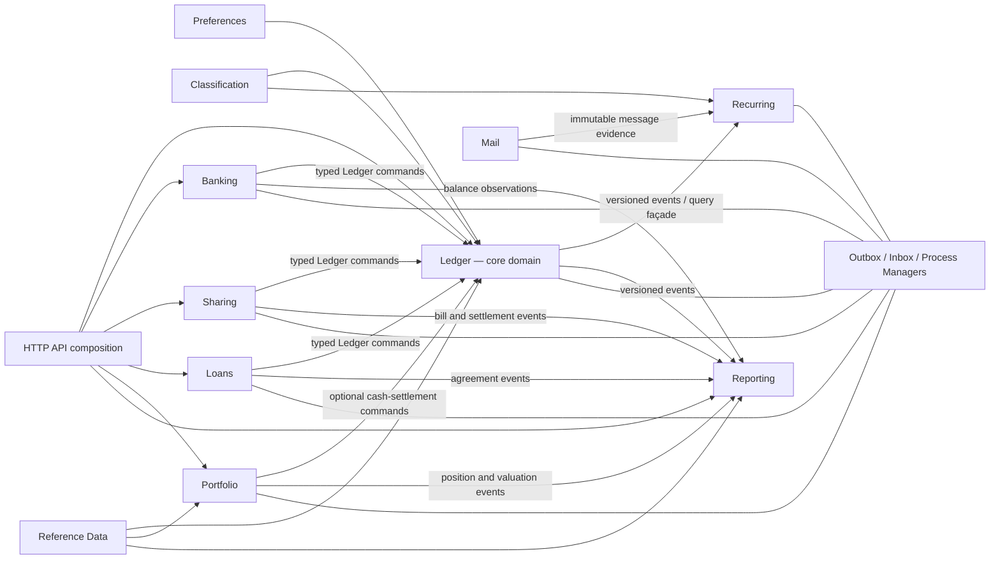
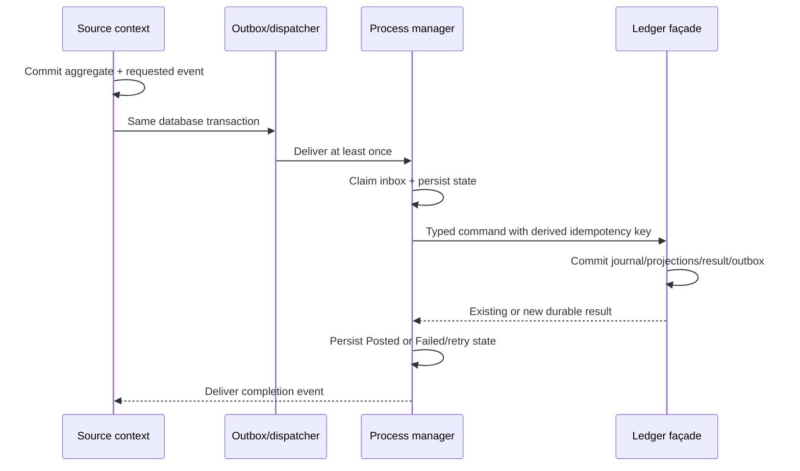

# Financial Core V2 — DDD Architecture Design

**Date:** 2026-08-05
**Status:** Accepted for implementation planning
**Scope:** Replacement financial core for the development-only Moneykeeper deployment

## Purpose

Moneykeeper V2 must make every monetary change explainable and rebuildable. Users can manage cash, debit and credit cards, current accounts, jars, borrowed and lent loans, and manual ОВДП positions. Account balances are calculated from immutable postings. A balance can be corrected, but a correction is a new, visible financial event rather than an overwrite.

The implementation is a context-first DDD modular monolith backed by PostgreSQL. The Ledger is the source of truth for money movements. Banking, Sharing, Loans, and Portfolio own their respective business workflows and ask Ledger to record typed accounting effects through durable process managers.

This design intentionally replaces the legacy account/transaction model. It does not attempt to preserve its API or data.

## Accepted decisions

- Use a context-first module layout rather than the current horizontal `domain/application/infrastructure` layout.
- Use strict double-entry accounting. A posted journal entry is balanced separately for every currency represented in it.
- Store amounts as validated `rust_decimal::Decimal` values paired with an ISO 4217 currency code. JSON amounts are decimal strings, never JSON floating-point numbers.
- Expose task-oriented commands. No public endpoint accepts account IDs plus arbitrary debit/credit postings.
- Treat posted monetary fields as immutable. Reverse or replace; never edit or hard-delete.
- Derive account balances from postings and maintain rebuildable projections transactionally.
- Correct a balance by posting the difference against reconciliation equity, with actor, reason, before/target values, and timestamps retained.
- Keep provider-reported and available balances separate from the Ledger balance. A discrepancy creates a case that a user approves or dismisses.
- Use a personal Monobank X-Token behind a provider adapter for the first Banking implementation.
- Support Monobank cards/current accounts and jars as distinct provider resources. Provider securities do not become cash accounts.
- Support contacts-first Split the Bill with multiple payers, equal or exact shares, partial settlement, existing-transaction linking, and visible reversal.
- Model borrowed and lent loans in a Loans bounded context while Ledger owns all resulting money movements.
- Model ОВДП as positions and lots in Portfolio, not as a scalar cash balance. V1 supports manual instruments, trades, coupons, maturity, and valuation.
- Coordinate cross-context work with transactional outbox/inbox records and durable, retryable process managers.
- Create a brand-new empty V2 PostgreSQL database and a new migration root. Never edit the checksum-frozen legacy migrations and never run the V2 binary against the legacy database.
- Replace the unversioned API in one breaking development cutover. There is no `/v2` compatibility surface and no dual write.

## Goals

1. Every displayed Ledger balance can be reproduced exactly from immutable postings.
2. Every change has a user, system, or provider actor, an idempotency identity, a reason/source, and recorded/effective timestamps.
3. Transfers, fees, projections, idempotency results, audit records, and outbox events commit atomically inside Ledger.
4. Provider retries, duplicate HTTP requests, and worker crashes have at most one financial effect.
5. Context ownership is visible in both Rust modules and PostgreSQL schemas.
6. Supporting capabilities—Gmail ingestion, recurring-charge matching, reporting, Split the Bill, loans, and ОВДП—depend only on published façades and versioned events.
7. Financial history is archived or reversed, never erased as a normal user action.

## Non-goals for V1

- Migrating legacy financial rows or credentials.
- A public generic journal/posting API.
- Registered-user invitations or claiming a Sharing contact as an application user.
- Automatic loan amortization schedules or repayment reminders.
- Broker integration, live ОВДП pricing, tax accounting, or corporate actions beyond coupons and maturity/redemption.
- Cryptocurrency, commodity, or non-ISO cash units in Ledger.
- Distributed microservices. Context boundaries are enforced inside one deployable application.

## Context map



Ledger has no dependency on Banking, Mail, Recurring, Sharing, Loans, Portfolio, or Reporting. Integrating contexts depend on the narrow contracts in `contexts::ledger::public`, not on Ledger domain types, repositories, SQL, or tables.

## Source layout

```text
src/
  shared_kernel/
    ids.rs
    money.rs
    currency.rs
    idempotency.rs
    clock.rs
    events.rs
  contexts/
    ledger/
      domain/
      application/
      infrastructure/
      api/
      public.rs
    banking/
      domain/
      application/
      infrastructure/monobank/
      api/
      public.rs
    mail/
    recurring/
    reporting/
    sharing/
    loans/
    portfolio/
    reference_data/
    classification/
    preferences/
  integration/
    outbox/
    inbox/
    process_managers/
    event_dispatcher/
  bootstrap/
```

Each context follows the same dependency direction:

```text
api -> application -> domain
                 ^
infrastructure --+
public -> application DTOs/ports only
```

Domain modules contain no Axum, SQLx, Reqwest, or provider-specific types. Repositories are aggregate ports, not table-shaped CRUD interfaces. Query ports return purpose-built read DTOs. Another context may import only `public.rs`, shared-kernel primitives, or versioned integration-event contracts.

## Shared kernel

The shared kernel is deliberately small:

- Typed IDs: `UserId`, `CorrelationId`, `CausationId`, `EventId`, plus a shared macro for context-owned opaque UUID IDs.
- `CurrencyCode`: a normalized uppercase, three-letter ISO-shaped code. An application boundary resolves it through `reference_data::public` before accepting financial input; the shared kernel never imports the Reference Data context.
- `Money`: a currency plus a finite, bounded `Decimal`, constructible only through a checked factory that receives the resolved currency's minor-unit scale. This preserves the scale invariant without putting an ISO catalog or context dependency in the shared kernel.
- `IdempotencyKey`: validated, bounded opaque text; stored with command scope and request hash.
- `Clock`: injectable wall-clock abstraction.
- `EventEnvelope`: event ID, versioned type, aggregate identity/version, tenant, correlation/causation IDs, occurrence time, and JSON payload.

It must not contain `Account`, `Transaction`, provider resources, repositories, HTTP DTOs, or a generic event bus.

### Money contract

API example:

```json
{
  "amount": "1250.00",
  "currency": "UAH"
}
```

Rules:

- Parse inbound decimal strings into a raw API/event DTO, resolve the currency definition through `reference_data::public`, then construct `Money` with its minor-unit scale. Do not derive an unrestricted `Deserialize` path that can bypass this factory.
- Parse decimal strings exactly; reject exponent notation and non-canonical currency codes at the boundary.
- Reject values outside the chosen PostgreSQL numeric bounds and values with excess currency scale.
- Never derive equality from a converted or rounded floating-point value.
- Rounding is an explicit domain operation with a named mode. Equal Split the Bill allocation uses integer minor units and deterministic remainder assignment.
- Quantities, prices, FX rates, and accrued interest are separate value objects because their scale rules differ from `Money`.

## Persistence ownership

The V2 migration root is `src/infrastructure/migrations_v2`. It creates schemas owned by bounded context:

```text
shared_kernel
reference_data
preferences
classification
integration
ledger
banking
mail
recurring
reporting
sharing
loans
portfolio
```

Reference Data owns the ISO currency catalog and external FX observations. Classification owns each user's category taxonomy and archive/version rules. Ledger owns the immutable annotation history that references a category; it validates the category through `classification::public` and never reads Classification tables. Recurring may store a default category reference but applies it only through Ledger's annotation command.

Every tenant aggregate has `UNIQUE (id, user_id)`. Child rows use composite `(parent_id, user_id)` foreign keys so the database rejects cross-user relationships inside a context. Cross-context references store both the external ID and `user_id`; correctness is established through the owning context's public contract and integration event. Cross-context SQL joins and triggers are forbidden.

The V2 database contains an immutable `shared_kernel.database_lineage` singleton whose marker is `finance-v2`. The only public V2 initialization function connects, safely migrates, verifies that marker/latest baseline, and returns a wrapper with no unchecked public constructor; contexts cannot be built from an unverified pool. V2 startup completes this before starting HTTP listeners or workers. The legacy migration directory remains unchanged for forensic history and is never in the V2 migrator path.

## Ledger domain

### LedgerAccount aggregate

`LedgerAccount` represents a book account, not a provider connection or a portfolio position.

Core fields:

- `LedgerAccountId`, `UserId`, name, currency, optimistic version.
- `AccountNature`: `Asset`, `Liability`, `Equity`, `Income`, or `Expense`.
- `AccountKind`: `Cash`, `DebitCard`, `CreditCard`, `Current`, `Savings`, `Jar`, `LoanPayable`, `LoanReceivable`, or an internal system role.
- Authority/policy: manual, provider-observed, or system-managed.
- Lifecycle: active or archived.
- Visibility: user-visible or hidden system account.

Public account creation permits only Asset and Liability natures. Income, Expense, Equity, clearing, and control accounts are provisioned by Ledger. Account currency is immutable after creation. Archiving prevents new ordinary user commands but preserves reads, postings, and reversals; restore is version checked.

The aggregate does not own a mutable authoritative balance field. Balance is a projection of postings.

### JournalEntry aggregate

A journal entry is one immutable financial event and owns all of its postings.

Core fields:

- Journal ID, user ID, command type/source, status, description.
- Effective time and immutable recorded time.
- Actor, correlation/causation IDs, and idempotency identity.
- Provider provenance or originating-context reference when present.
- Reversal/replacement relationships.
- Two or more immutable, non-zero postings.

Posting convention:

- Positive amount: debit.
- Negative amount: credit.
- Asset and Expense display balances use the raw posting sum.
- Liability, Equity, and Income display balances negate the raw posting sum.

Commit invariants:

1. Every posting belongs to the same user as its journal.
2. Every account belongs to that user and has the posting currency.
3. An entry contains at least two non-zero postings.
4. `SUM(posting.amount) = 0` independently for every currency in the entry.
5. Posted monetary rows cannot be updated or deleted.
6. A journal can be reversed at most once; the reversal is a new balanced journal with exact inverse postings.
7. Idempotency scope plus key has one request hash and one durable result.

A deferred PostgreSQL constraint trigger checks the complete per-currency balance at transaction commit. Application validation gives useful errors earlier; the database constraint is the final guard.

### Standard posting shapes

| User task | Debit | Credit |
|---|---|---|
| Opening asset balance | User asset | Opening equity |
| Opening liability balance | Opening equity | User liability |
| Expense | Expense system account | Cash/card asset |
| Income | Cash/card asset | Income system account |
| Same-currency transfer | Destination asset or liability | Source asset or liability |
| Positive asset correction | User asset | Reconciliation equity |
| Reduce asset balance | Reconciliation equity | User asset |
| Borrowed-loan repayment | Loan liability plus interest/fee expense | Cash asset |
| Lent-loan receipt | Cash asset | Loan receivable plus interest income |

For FX, both currencies balance through hidden clearing accounts:

```text
USD: credit source USD account; debit USD FX clearing
UAH: debit destination UAH account; credit UAH FX clearing
```

Fees are explicit postings and never folded invisibly into an exchange rate.

Ledger lazily provisions hidden per-user/per-currency system accounts for uncategorized income, uncategorized expense, opening equity, reconciliation equity, and FX clearing. Typed internal commands may introduce a named control/clearing role for another context, such as Portfolio settlement; this is not exposed through the public HTTP API and Reporting excludes control accounts from net worth.

### TransactionAnnotation aggregate

Notes, category, tags, and budget visibility are versioned annotation changes. They do not mutate a posted journal or its monetary fields. Each change retains actor and audit history and publishes a classification event.

### Balance projection

`ledger.account_balances` stores the raw posting sum, normalized display balance, projection sequence, version, and `as_of`. Posting a journal locks affected account projections in stable account-ID order and updates them in the same SQL transaction as:

- journal and postings;
- idempotency record/result;
- audit record;
- Ledger outbox events.

The projection is a cache, not source of truth. A rebuild truncates or replaces projection rows from posting sums and must produce byte-for-byte equivalent amounts and journal sequence positions. Rebuild runs under an operational lock and atomically swaps the rebuilt projection.

### Balance correction and reconciliation

Manual correction accepts target balance, observation time, required reason, and expected account-balance version. Ledger calculates `display_delta = target - current display balance` under a lock, then converts it to posting convention as `signed_posting_delta = display_delta * normal_sign` (`+1` for Asset/Expense, `-1` for Liability/Income/Equity). It posts that amount against reconciliation equity. The response exposes display-balance before, target, display delta, resulting balance, actor, and journal ID.

Banking balance observations do not change Ledger. Comparable facts are serialized per account/source stream by `(observed_at, source_sequence, observation_id)` and create or refresh a `ReconciliationCase` containing:

- Ledger balance/version at observation;
- provider-reported and available balances;
- difference and provider observation time;
- provider resource/provenance;
- status and decision audit trail.

An older/duplicate observation remains auditable/linkable but cannot regress the active case; a newer observation supersedes the previous pending version. Approval is version checked and allowed only for the latest active case. If the account projection has changed since the case was calculated, the case becomes stale and must be recomputed rather than applying an obsolete delta. Approval posts a visible reconciliation journal; dismissal records a non-financial decision.

## Public finance API

The replacement API remains unversioned at cutover. Financial POST commands require `Idempotency-Key`. Aggregate metadata commands carry an explicit `expected_version` field in the request body. Reusing an idempotency key with a different canonical request hash returns `409 Conflict`.

Primary routes:

```text
POST   /accounts
PATCH  /accounts/{id}
POST   /accounts/{id}/archive
POST   /accounts/{id}/restore
GET    /accounts/{id}
GET    /accounts/{id}/activity

POST   /transactions
POST   /transfers
POST   /accounts/{id}/balance-corrections
POST   /reconciliations/{id}/approve
POST   /transactions/{id}/reversals
POST   /transactions/{id}/replacements
PATCH  /transactions/{id}/annotation

POST   /provider-connections/monobank
GET    /provider-connections/{id}/resources
POST   /provider-connections/{id}/resource-mappings
POST   /provider-connections/{id}/sync-jobs
GET    /sync-jobs/{id}

POST   /contacts
POST   /bill-splits
POST   /bill-splits/{id}/revisions
POST   /bill-splits/{id}/settlements
POST   /bill-splits/{id}/settlements/{settlement_id}/reversal

POST   /loans
POST   /loans/{id}/disbursements
POST   /loans/{id}/repayments
POST   /loans/{id}/interest-accruals
POST   /loans/{id}/write-offs

POST   /portfolio-accounts
POST   /instruments/ovdp
POST   /portfolio-transactions
POST   /portfolio-transactions/{id}/reversals
POST   /valuations
```

Supporting operations are part of the same authenticated, unversioned replacement API and OpenAPI document:

```text
GET    /currencies
GET    /currencies/{code}
GET    /fx-rates?base_currency={code}&quote_currency={code}&as_of={timestamp}

POST   /categories
GET    /categories
GET    /categories/{id}
PATCH  /categories/{id}
POST   /categories/{id}/archive
POST   /categories/{id}/restore

GET    /preferences
PATCH  /preferences
```

Currency and FX reads are side-effect free. Category metadata changes and preference updates require `expected_version`, but do not require `Idempotency-Key` because they have no financial effect. Phase-specific plans define the additional Mail, Recurring, Reporting, resource-mapping lifecycle, credential-rotation, settlement, loan lifecycle, and Portfolio lifecycle routes; Phase 8 requires exhaustive router/OpenAPI parity before cutover.

`POST /transactions` is a discriminated task request for income or expense. Transfers, corrections, reversals, replacements, provider imports, Sharing accounting, loan accounting, and Portfolio cash settlement have separate command types. No route accepts arbitrary postings.

Account reads are composed from Ledger and Banking/Reporting read models and expose:

```json
{
  "balances": {
    "ledger": "1250.00",
    "provider_reported": "1240.00",
    "available": "2240.00",
    "reconciliation_difference": "-10.00",
    "currency": "UAH",
    "version": 17,
    "as_of": "2026-08-05T12:00:00Z"
  }
}
```

Unavailable provider fields are `null`, not copied from the Ledger value.

## Integration reliability model

Each producing command writes its aggregate, context-owned scoped command receipt where applicable, and an outbox envelope atomically. A receipt contains the canonical request hash and exact durable result; same-scope/key replay with a different hash is a conflict. Consumers claim outbox records with leases. A consumer first records `(consumer_name, event_id)` in its inbox, making duplicate delivery harmless.

Longer workflows use a process-manager state machine keyed by a stable correlation ID. A typical cross-context workflow is:



There is no distributed transaction. A crash after Ledger commits but before process-manager completion causes a retry; Ledger returns the existing idempotent result. Failed states retain error class, attempts, and next retry time. Business validation failures become visible terminal failures; transient failures back off and remain retryable.

Initial versioned event types include:

- `reference-data.fx-observed.v1`
- `ledger.journal-posted.v1`
- `ledger.journal-reversed.v1`
- `ledger.annotation-changed.v1`
- `banking.provider-event-ready.v1`
- `banking.balance-observed.v1`
- `sharing.accounting-requested.v1`
- `sharing.settlement-accounting-requested.v1`
- `loans.accounting-requested.v1`
- `portfolio.cash-settlement-requested.v1`

Event consumers ignore unknown additive payload fields, reject unknown major event versions, and dead-letter malformed envelopes without advancing their durable checkpoint.

## Banking and Monobank

`ProviderConnection` owns encrypted active/pending credential generations, state, webhook secret/registration state, rate-limit state, and connection version. One personal X-Token identity is one connection. Initial and replacement credentials remain pending until Monobank client-info validates them; a valid replacement activates within the same connection, preserves resources/mappings, fences old worker generations, and retires old usable ciphertext. An invalid candidate never displaces a still-valid active generation; otherwise the connection remains a visible reauthorization failure and cannot start ordinary sync.

`ExternalResource` represents one discovered Monobank card/current account or jar, with provider ID, kind, native currency, masked metadata, product type, credit limit, funding model, provider balance fields, discovery status, and optional Ledger mapping. It does not own the Ledger account. A confirmed own-funds card/current account maps to an Asset kind; a confirmed revolving-credit card maps to a Liability/CreditCard kind; unknown or contradictory provider funding metadata blocks automatic creation/mapping and becomes visible review state. A later funding-policy change cannot silently mutate an existing Ledger account's nature. Mapping can bind a compatible existing account or durably request creation of a provider-observed account; both paths validate tenant and native currency first. Mapping deactivation/replacement is versioned and audited, preserves the prior mapping/effective boundary, and affects only later provider revisions—historical Ledger journals are never moved. The personal X-Token adapter does not invent an ОВДП/security resource—manual securities belong to Phase 7 Portfolio.

Provider balance fields retain their declared provider basis/sign separately. The Monobank adapter may also emit a Ledger-comparable normalized display balance only when its tested product semantics support that conversion for the mapped account nature. A non-comparable observation remains visible with a reason and does not produce a misleading reconciliation delta; comparable discrepancies create Ledger-owned cases as usual.

`ProviderEvent` and its revisions are durable provider facts. Identity is scoped by connection/resource/external event ID; a revision or payload-hash change is retained rather than discarded. Financial processing is serialized per event stream: revision N+1 waits until every known predecessor is posted, no-financial-change, or explicitly terminal, so a correction/reversal cannot race ahead of the journal it references. Raw payload provenance is encrypted or access-restricted and redacted from normal logs.

Sync jobs have requested ranges, durable cursor, overlap window, lease owner/expiry, attempt count, retry time, and last error. A page cursor advances only after every event in that page reaches a durable processed or explicitly quarantined state. Rate limiting is per credential.

The import process manager translates provider language through the Monobank anti-corruption layer and invokes typed Ledger import/update commands. Hold-to-settled changes that do not alter monetary data update visible provider state without rewriting postings. A monetary correction or reversal produces an explicit Ledger reversal/replacement chain.

The first monetarily complete pending/hold revision posts one provisional-source journal and therefore participates in the Ledger balance. A later settled revision with identical monetary facts appends provider-state/link history but has no second posting effect. Changed monetary facts use reversal/replacement; cancellation/reversal uses a reversal journal. This policy is explicit so retries and hold transitions cannot silently double count or make the displayed Ledger balance depend on provider status mutation.

Monobank callback routes are exactly `GET /webhooks/monobank/{webhook_credential}` for validation and `POST /webhooks/monobank/{webhook_credential}` for intake. The credential has at least 256 bits of entropy, is encrypted at rest for registration retry, and also has a keyed lookup digest; invalid credentials receive a generic response. The routes are intentionally excluded from public OpenAPI but remain part of the tested internal route manifest. Access logs record only the route template, never the raw request target. Activation/secret rotation durably registers the callback with Monobank and retains retry state. Webhook receipt only persists/queues provider work; it never directly mutates Ledger.

## Mail, Recurring, and Reporting

Mail owns encrypted Gmail connections, immutable source messages, append-only fetch/parse attempts, durable leases, cursors, and OAuth state. Credentials are never persisted in plaintext or logged. Because V2 is a new database, users reconnect Gmail.

Recurring owns subscriptions, receipt/charge evidence, lifecycle, match events, and a local projection of Ledger payment candidates. A match references one or more Ledger journal entries with allocated `Money`. Matches and rejections are append-only. Categorization is requested through Ledger's public command and remains auditable. Recurring never reads or updates Ledger tables.

Reference Data owns append-only external FX observations and durable source synchronization. An observation defines a positive Decimal `base -> quote` rate, effective/source/recorded times, source revision, and provenance digest. Reporting consumes versioned rate events into a local projection, uses historical as-of semantics, and represents missing conversion explicitly; it never substitutes a current rate into a historical report. Reference rates may suggest a transfer but never mutate or auto-price a posted Ledger journal.

Reporting owns rebuildable projections for balance history, cashflow, spending, liabilities, provider reconciliation, recurring totals, bill positions, loan summaries, Portfolio valuation, and net worth. It has no financial write capability. Rebuilds consume versioned event feeds/public export façades and never repair Ledger state.

## Sharing — Split the Bill

### Aggregate model

- `Contact`: a user-owned external person; not an application identity.
- `BillSplit`: immutable currency, total, participants, contributions, shares, current revision, status, and version.
- `Contribution`: amount paid by current user or a contact. Current-user contributions can allocate one or more existing outgoing Ledger journals or request a manual payment from a selected account.
- `ParticipantShare`: exact amount or equal-allocation result.
- `Obligation`: deterministic debtor-to-creditor amount derived from net positions.
- `Settlement`: partial/full repayment, optionally created as a manual Ledger movement or linked to an existing imported journal.

The participant universe is the union of contribution owners and share recipients, so someone may pay without consuming a share or consume a share without paying. Contribution rows are positive; exact/resolved shares are non-negative, and deterministic equal splitting may legitimately assign zero minor units when the total is smaller than the selected participant count. Both contribution total and share total must equal the positive bill total exactly in minor units. For participant `p` (with an absent contribution/share treated as zero):

```text
net(p) = contributions(p) - shares(p)
```

Positive net means the participant should receive money; negative net means they owe. A deterministic waterfall matches debtors and creditors by stable participant ID after placing the current user first for remainder/ordering rules. The obligations always sum to zero and never exceed a participant's net position.

Equal allocation calculates integer minor units. Remainder units go to the current user when included, then to participants ordered by stable ID. The persisted shares—not a later recalculation—are the bill's truth.

Sharing creates hidden contact receivable/payable Ledger accounts per contact/currency only for obligations involving the current user. Contact-to-contact obligations remain Sharing facts. The accounting process manager reclassifies the current user's linked payment or creates typed expense/receivable/payable entries, then moves the bill from `PendingAccounting` to `Active` or `Failed`.

Settlements support partial amounts. Linking an existing imported income/expense journal produces a typed reclassification journal rather than editing the imported entry. Over-settlement is rejected under an aggregate lock. A bill cannot be revised or cancelled while it has active settlements; reverse settlements first. Bill revisions reverse the prior accounting effect and post the replacement, retaining both revisions. Cancellation is a durable, visible reversal of the active bill accounting followed by a `Cancelled` state, never deletion.

## Loans

`LoanAgreement` owns direction (`Borrowed` or `Lent`), counterparty, contractual principal/currency, linked Ledger liability or receivable account, terms, dates, status, and optimistic version.

Loans commands record origination/disbursement, principal repayment, interest, fees, manual interest accrual, write-off, reversal, and closure. Every repayment separates principal, interest, and fees. The Loans process manager uses typed, idempotent Ledger commands and records `PendingAccounting`, `Posted`, or `Failed` workflow state. Contractual terms never mutate Ledger rows, and Ledger does not calculate loan schedules.

## Portfolio and manual ОВДП

Portfolio owns:

- user-owned `Instrument` records with ISIN/manual ID, currency, face value, issue/maturity dates, and coupon terms;
- `PortfolioAccount` records for broker/custodian grouping;
- immutable `PortfolioTransaction` records for opening positions, buys, sells, coupons, redemption, corrections, and reversals;
- `PositionLot` acquisition and disposal allocations;
- append-only `ValuationSnapshot` records for price and accrued interest.

Purchases/opening positions create lots. V1 ОВДП quantity is whole bonds; valuation snapshots use absolute instrument-currency price and accrued interest per bond rather than an ambiguous percent/yield input. Disposals use explicit allocations when supplied and FIFO otherwise. Derived projections expose quantity, remaining book cost basis, realized book gain/loss, and market value; these are not presented as tax calculations. Missing cost basis is represented explicitly, not guessed.

Optional cash settlement goes to Ledger through a typed process manager and a shared correlation ID. Original and cancel/reverse commands share a source-operation identity that Ledger serializes: cancellation before posting prevents a late original effect, while cancellation after posting creates one compensating reversal. Ledger uses a hidden Portfolio settlement control account; Reporting excludes it from net worth and combines Ledger cash/liabilities with Portfolio market value exactly once. Portfolio value never overwrites a Ledger account balance.

## Security and audit

- Every query and command is tenant scoped; composite keys and ownership checks provide defense in depth.
- Provider and OAuth credentials are encrypted-only with key version/fencing and redacted `Debug` implementations.
- Webhooks authenticate with connection-specific secrets and are rate limited.
- Raw provider/email payloads have restricted access, retention policy, and no routine body logging.
- Audit records include actor type/ID, command, target, request/correlation IDs, effective/recorded times, reason, and before/after metadata when applicable.
- Financial audit and journal records are append-only. Administrative retention jobs may redact sensitive raw payloads but cannot delete accounting provenance.

## Concurrency and consistency

- Aggregate metadata uses optimistic version checks.
- Financial commands lock affected Ledger account projections in stable ID order.
- Idempotency records are unique by `(user_id, command_scope, key)` and include a canonical request hash.
- Reversal uniqueness is enforced in the database.
- Sharing source-allocation and settlement totals are protected by aggregate locks and constraints.
- Workers use leases with expirations; ownership tokens fence stale workers.
- Event sequence/checkpoint ordering is total and stable, using recorded sequence plus ID as tie-breaker.

The user-facing consistency promise is: a successful financial command response means its journal, balance effect, audit record, and event are committed. Cross-context summaries may be briefly eventual and expose `as_of`/processing status.

## Verification strategy

### Domain/property tests

- Money parsing, scale bounds, checked arithmetic, and JSON round trips.
- Journal per-currency balancing and exact reversal symmetry.
- Account-nature display sign normalization.
- Equal/exact split allocation, deterministic remainder, obligation conservation.
- FIFO/explicit lot allocation and realized-gain arithmetic.

### Database invariant tests

- Reject cross-user references, wrong-currency postings, zero postings, unbalanced commits, posted-row update/delete, and duplicate reversal.
- Confirm aggregate/outbox/idempotency/projection rollback together on injected failure.
- Confirm one financial effect under concurrent duplicate requests.
- Rebuild Ledger and Reporting projections and compare exactly.

### Workflow tests

- Monobank duplicate/revision/hold/settled/reversal, partial-page failure, cursor recovery, and webhook authentication.
- Gmail leases, retries, immutable messages, append-only attempts, and recurring many-to-many allocations.
- Multi-payer bills, receivable/payable accounting, partial manual/imported settlements, revisions, and reversal requirements.
- Borrowed/lent loan flows with separated principal/interest/fees.
- ОВДП opening, purchase, FIFO sale, coupon, redemption, correction, valuation, and optional Ledger cash correlation.

### Required quality gates

```bash
cargo fmt --check
cargo clippy --all-targets -- -D warnings
cargo test
SQLX_OFFLINE=true cargo test --test v2_migrations -- --nocapture
```

The cutover also requires OpenAPI validation and CI architecture scans that reject context-private imports and executable SQL referring to legacy finance tables.

## Cutover constraints

1. Complete and verify every V2 context against a fresh database before switching runtime wiring.
2. Stop legacy Monobank, Gmail, recurring, FX/lifecycle, and other workers before changing `DATABASE_URL`.
3. Provision a new database/volume; do not clear or reuse the legacy SQLx migration ledger.
4. Change every application and test migrator to `migrations_v2` in the cutover revision.
5. Verify the V2 database marker before starting listeners or workers.
6. Mount the replacement routes at the existing unversioned root and remove legacy handlers/services/repositories from executable wiring.
7. Require users to reconnect Monobank and Gmail.
8. Preserve `src/infrastructure/migrations` unchanged for forensic history; keep a checksum guard but do not execute it in V2 tests.

Because this is a development-only reset, rollback means switching the application and `DATABASE_URL` back to the untouched legacy deployment. There is no reverse data migration and no dual-write recovery path.

## Architecture acceptance criteria

- A balance is explainable as a sum of immutable postings and correction/reversal history.
- No context imports another context's repository/infrastructure module or issues SQL against its private schema.
- Every cross-context financial effect is typed, idempotent, durable, and exposes pending/posted/failed status.
- Monobank snapshots cannot overwrite Ledger balances.
- Split the Bill supports multiple payers without treating repayment as income or a participant share as a second expense.
- Loans distinguish principal, interest, and fees.
- ОВДП positions and valuations do not masquerade as cash.
- A fresh V2 database passes all invariants, while legacy migrations remain byte-for-byte unchanged.
